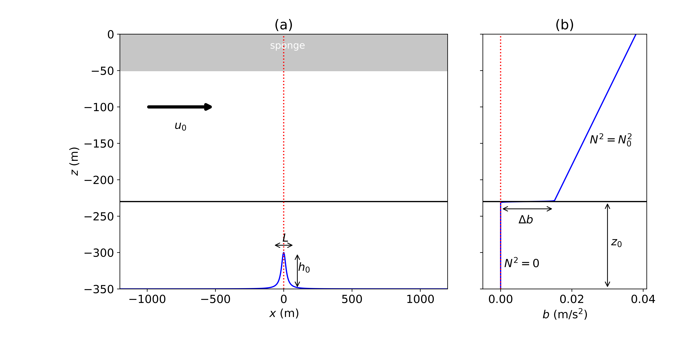

# 2D_seaice_simulations
Code repository to support manuscript titled "Nondimensional parameter regimes of Arctic ice keel-ocean flow interactions"

The code is for two-dimensional idealized numerical simulations of a sea ice keel interacting with the underlying ocean approximating the Arctic Ocean conditions. Simulations are conducted in the frame of reference of the sea ice keel, such that the keel is stationary (modeled as an immersed boundary) and the flow has background velocity relative to the keel that provides forcing. 

### Model set-up

Rotating incompressible Navier-Stokes equations with Boussinesq approximation are solved in a two-dimensional $$(x,z)$$ domain using Oceananigancs. In the current implementation of Oceananigans, an immersed boundary can only be specified along the bottom, and not the top boundary. However, in the Boussinesq approximation, flows are symmetric when flipped upside down if the sign of buoyancy is also reversed. We use this property to implement an "ice keel" along the bottom of the domain and reverse the sign of the initial vertical buoyancy profile.

- The sea ice keel shape is modeled as a Versoria shape:

  $$h(x) = \frac{h\sigma^2}{\sigma^2+ 4x^2}$$

where $$h$$ is the depth/height of the keel and $$\sigma$$ is the width of the keel

- The term $fu_0$ is added to the $y$-momentum equation to represent steady background forcing, with $$f$$ being the local Coriolis parameter ($$f$$-plane approximation) and $$u_0$$ being the velocity of the fluid relative to the ice keel.

- Initial buoyancy profile is two layers with a mixed layer over the topography ("keel") separated from the weakly stratified interior by a strong pycnocline:

  $$b_0(z) = \frac{1}{2} \left(\Delta b - {N_0}^2\left(-H-z_0-z \right) \right)\left(1-\tanh{\left(\frac{-H-z_0-z}{\mu}\right) }\right)$$

where $$H$$ is the domain depth, $$N_0$$ is the buoyancy frequency in the weakly stratified interior, $$\Delta b$$ is the buoyancy jump across the pycnocline, and $$\mu$$ is the pycnocline width.

- An exponential sponge layer $e^{-z^2/2\delta^2}$ with $\delta=-H/20$ is implemented to avoid reflections off the rigid-lid surface at the top of the domain. Within the sponge layer, the flow is relaxed to the initial conditions: $$b_0(z)$$ for buoyancy, $$u_0$$ for $$u$$, and zero for $$w$$.

### Nondimensional parameters

- This problem is characterized by five nondimensional parameters:

  $$\chi = \frac{u_{0} k_{0}}{N_0}, \qquad J = \frac{N_0 h_{0}}{u_{0}}, \qquad \zeta = \frac{h_{0} k_{0}}{\pi}, \qquad \eta = \frac{z_{0}}{h_{0}}, \qquad \rm{Ri} = \frac{\Delta b}{k_{0} u_{0}^{2}}$$

  where $$u_0$$ is the background forcing velocity magnitude, $$L = 2\pi/k_0$$ is the width of the keel (for a sinusoidal shape, i.e., $$k_0$$ is the wavenumber), $$N_0$$ is the buoyancy frequency in the stratified interior below the mixed layer, $$h_0$$ is the keel depth, $$z_0$$ is the pycnocline depth, and $$\Delta b$$ is the buoyancy jump across the pycnocline.

- For all simulations, we set $u_0=0.1$ m/s and width of the Versoria-shaped obstacle (i.e., ice keel) to be $\sigma=40$ m (approximately matching a sinusoidal topography to a Versoria-shaped topography, $k_0 = \pi/2\sigma$).

- Compute all other dimensional parameters using the nondimensional parameter values as:

  $$N_0 = \frac{u_0 k_0}{\chi}, \qquad \Delta b = \rm{Ri} k_0 u_0^2, \qquad h_0 = \frac{\pi \zeta}{k_0}, \qquad \rm{and} \quad z_0 = -\eta h_0.$$

  
### Specific simulations

- "code" folder: code scripts to set up and run Oceananigans simulations (.jl files) for each of the six performed numerical simulations

- "analysis" folder: Jupyter Notebooks for analysis (.ipynb) for each of the six performed numerical simulations

- nondimensional parameters for each of the six performed numerical simulations (each "cluster"):

&emsp; &emsp; &emsp; * cluster 0: $$\chi=0.52, \quad J = 0.21, \quad \zeta = 0.033, \quad \eta = 55, \quad \rm{Ri} = 3.6$$

&emsp; &emsp; &emsp; * cluster 1: $$\chi=0.30, \quad J = 1.4, \quad \zeta = 0.13, \quad \eta = 27, \quad \rm{Ri} = 470$$

&emsp; &emsp; &emsp; * cluster 2: $$\chi=0.41, \quad J = 0.71, \quad \zeta = 0.093, \quad \eta = 8.4, \quad \rm{Ri} = 29$$

&emsp; &emsp; &emsp; * cluster 3: $$\chi=0.29, \quad J = 3.3, \quad \zeta = 0.31, \quad \eta = 2.0, \quad \rm{Ri} = 500$$

&emsp; &emsp; &emsp; * cluster 4: $$\chi=0.33, \quad J = 2.4, \quad \zeta = 0.25, \quad \eta = 2.6, \quad \rm{Ri} = 290$$

&emsp; &emsp; &emsp; * cluster 5: $$\chi=0.33, \quad J = 1.6, \quad \zeta = 0.17, \quad \eta = 5.1, \quad \rm{Ri} = 130$$

### Simulation data
Raw Oceananigans output for all six simulations is published under 10.5281/zenodo.17428869
